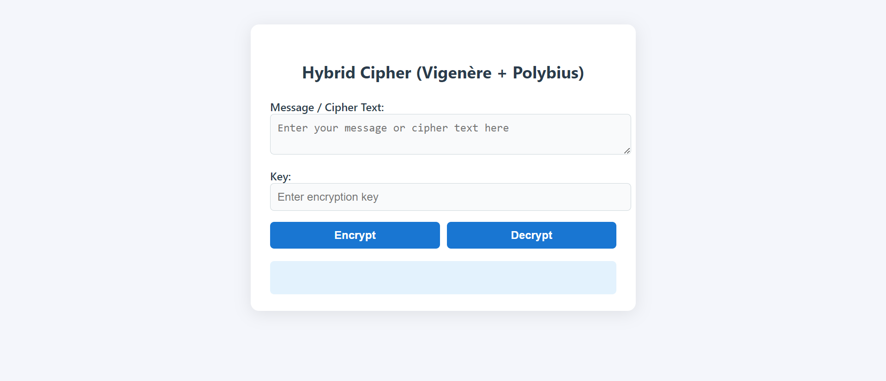
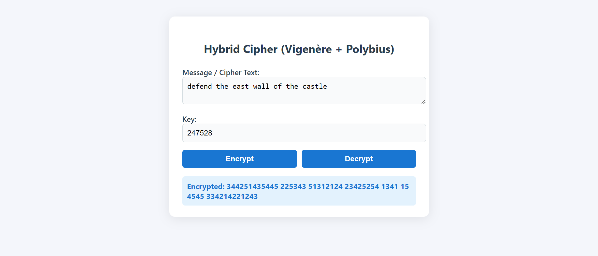
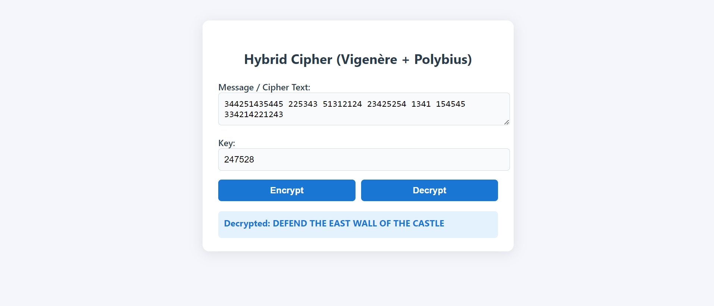

# Hybrid Cipher Web App (Vigenère + Polybius)

This project is a simple web application for encrypting and decrypting messages using a hybrid of the Vigenère and Polybius ciphers. It features a Python Flask backend and a modern HTML/CSS/JavaScript frontend.


*Screenshot of the Hybrid Cipher Web Application*

---

## Features

- 🔐 **Hybrid Encryption**: Combines Vigenère and Polybius ciphers for enhanced security
- 🌐 **Web Interface**: Clean, responsive HTML/CSS/JavaScript frontend
- 🔑 **Flexible Keys**: Supports both numeric and alphabetic encryption keys
- 📝 **Text Preservation**: Maintains spaces, punctuation, and special characters
- 🚀 **RESTful API**: Backend endpoints for programmatic access
- ⚡ **Real-time Processing**: Instant encryption and decryption
- 🎨 **User-friendly**: Intuitive interface with clear instructions

---

## Folder Structure

```
Hybrid-Cipher-Web-App/
├── app.py                 # Flask backend application
├── requirements.txt       # Python dependencies
├── README.md             # Project documentation
├── images/               # Screenshots and documentation images
│   ├── 1.png            # Main application screenshot
│   ├── 2.png            # Encryption example
│   └── 3.png            # Decryption example
├── static/              # Static web assets
│   ├── script.js        # Frontend JavaScript
│   └── style.css        # CSS styling
└── templates/           # HTML templates
    └── index.html       # Main web interface
```

---

## Requirements

- **Python**: 3.7 or higher
- **pip**: Python package installer
- **Web Browser**: Modern browser with JavaScript support

### Dependencies
- `Flask`: Web framework for Python
- `Flask-CORS`: Cross-Origin Resource Sharing support

---

## Installation

### 1. Clone the Repository
```bash
git clone https://github.com/shakiliitju/Hybrid-Cipher-Web-App.git
cd Hybrid-Cipher-Web-App
```

### 2. Set Up Virtual Environment (Recommended)
```bash
python -m venv .venv

# On Windows
.venv\Scripts\activate

# On macOS/Linux
source .venv/bin/activate
```

### 3. Install Dependencies
```bash
pip install -r requirements.txt
```

### 4. Run the Application
```bash
python app.py
```

### 5. Access the Web Interface
Open your browser and navigate to: **[http://127.0.0.1:5000](http://127.0.0.1:5000)**

---

## Usage

### Web Interface
1. **Enter your message** in the "Message / Cipher Text" field
2. **Enter your encryption key** (supports both numbers and letters)
3. **Click "Encrypt"** to convert your message to cipher text
4. **Copy the encrypted result** and paste it back into the message field
5. **Click "Decrypt"** to recover your original message

### Example Workflow:

*Step 1: Encrypting "defend the east wall in the castle" with key "SECRET"*


*Step 2: Decrypting the cipher text back to the original message*

### Command Line Example:
```python
# Using the API directly
import requests

# Encrypt a message
response = requests.post('http://127.0.0.1:5000/encrypt', 
                        json={'message': 'Hello World', 'key': 'SECRET'})
encrypted = response.json()['encrypted']

# Decrypt the message
response = requests.post('http://127.0.0.1:5000/decrypt', 
                        json={'cipher': encrypted, 'key': 'SECRET'})
decrypted = response.json()['decrypted']
```

---

## API Endpoints

### `POST /encrypt`
Encrypts a plaintext message using the hybrid cipher.

**Request Body:**
```json
{
  "message": "YOUR_MESSAGE",
  "key": "YOUR_KEY"
}
```

**Response:**
```json
{
  "encrypted": "CIPHER_TEXT"
}
```

### `POST /decrypt`
Decrypts a cipher text back to the original message.

**Request Body:**
```json
{
  "cipher": "CIPHER_TEXT",
  "key": "YOUR_KEY"
}
```

**Response:**
```json
{
  "decrypted": "ORIGINAL_MESSAGE"
}
```

### `GET /`
Serves the main web interface.

---

## How It Works

### Hybrid Cipher Algorithm
This application uses a combination of two classical ciphers:

1. **Vigenère Cipher**: A polyalphabetic substitution cipher that uses a keyword to shift letters
2. **Polybius Square**: A substitution cipher that replaces letters with coordinate pairs

### Encryption Process:
1. Input text is converted to uppercase and 'J' is replaced with 'I'
2. Vigenère cipher is applied using the provided key
3. Polybius square transformation converts letters to number pairs
4. Result is a string of digits representing the encrypted message

### Decryption Process:
1. Number pairs are converted back to letters using the Polybius square
2. Vigenère decryption is applied using the same key
3. Original message is recovered

---

## Security Notes

⚠️ **Important**: This is a demonstration of classical cryptography and should **NOT** be used for securing sensitive information. Classical ciphers like Vigenère and Polybius are easily broken with modern cryptanalysis techniques.

**Educational Purpose Only**: This project is designed for:
- Learning classical cryptography concepts
- Understanding cipher combinations
- Web development demonstration
- API design examples

---

## Contributing

1. Fork the repository
2. Create a feature branch (`git checkout -b feature/new-feature`)
3. Commit your changes (`git commit -am 'Add new feature'`)
4. Push to the branch (`git push origin feature/new-feature`)
5. Create a Pull Request

---

## Notes

- **Character Support**: The cipher fully supports English letters (A-Z). Spaces, punctuation, and numbers are preserved but not encrypted
- **Key Format**: Supports both numeric keys (e.g., "12345") and alphabetic keys (e.g., "SECRET")
- **Case Handling**: Input is converted to uppercase for consistency
- **File Structure**: Ensure the `templates` and `static` folders are in the same directory as `app.py`
- **Dependencies**: All required packages are listed in `requirements.txt`

---

## Troubleshooting

### Common Issues:

**Port Already in Use:**
```bash
# Kill process using port 5000
lsof -ti:5000 | xargs kill -9  # macOS/Linux
netstat -ano | findstr :5000   # Windows
```

**Module Not Found:**
```bash
# Ensure virtual environment is activated and dependencies installed
pip install -r requirements.txt
```

**CORS Errors:**
- Flask-CORS is included to handle cross-origin requests
- Ensure Flask-CORS is properly installed

---

## License

MIT License - feel free to use this project for educational purposes.

---

## Author

**Md. Shakil Hossain**
- GitHub: [@shakiliitju](https://github.com/shakiliitju)
- Project: [Hybrid-Cipher-Web-App](https://github.com/shakiliitju/Hybrid-Cipher-Web-App)
